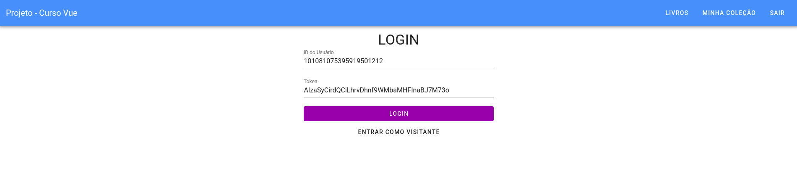
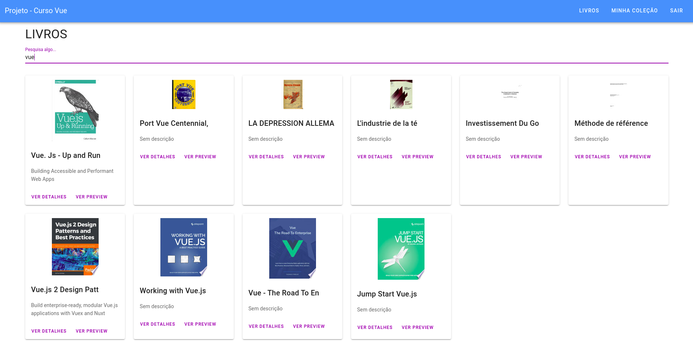

# projeto-curso-vue

<p align="center"></p>
<p align="center"></p>

## Resumo do Projeto
Projeto feito baseado em curso de Vue JS 2.

## Tecnologias Utilizadas
npm, Pop OS Linux 64bits, Vuex, Vuetify e Axios(para facilitar requisicoes a API).

## Project setup
```
npm install
```

### Compiles and hot-reloads for development
```
npm run serve
```

### Compiles and minifies for production
```
npm run build
```

### Lints and fixes files
```
npm run lint
```

### Customize configuration
See [Configuration Reference](https://cli.vuejs.org/config/).
